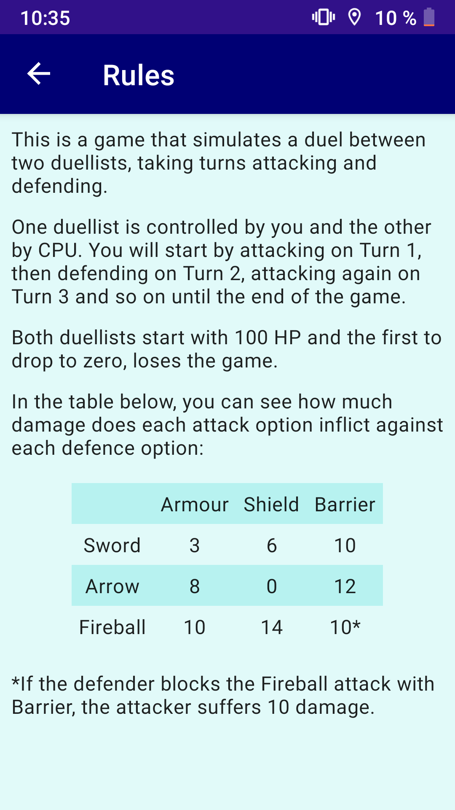
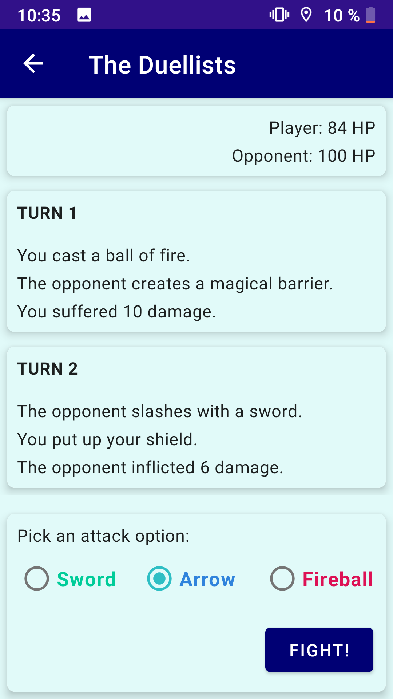
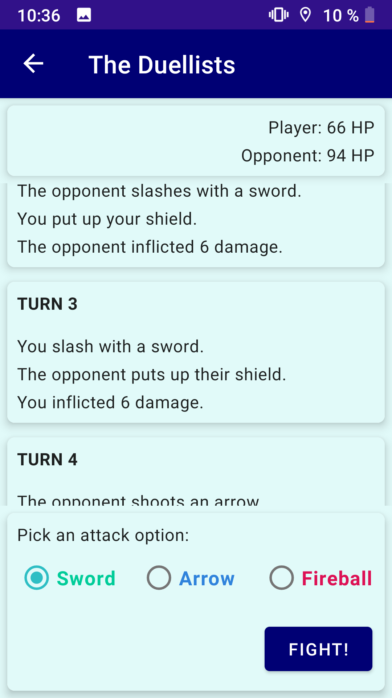
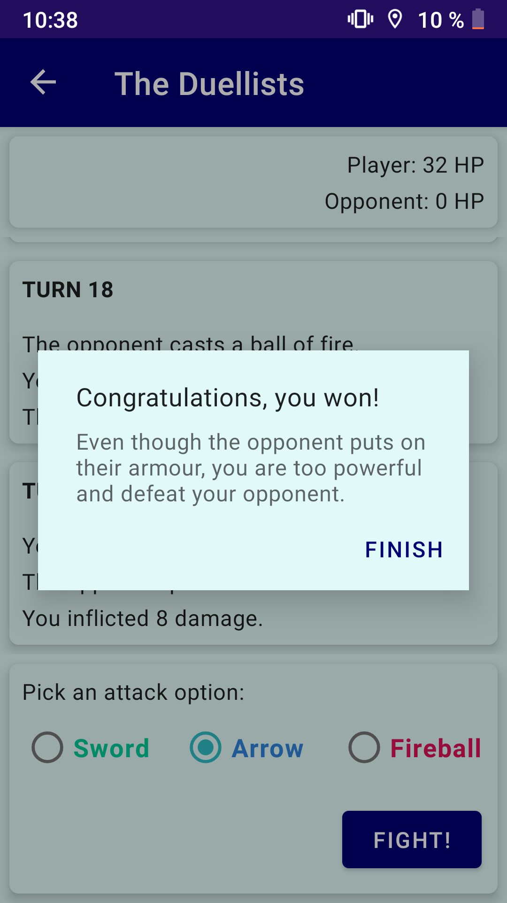

[RULES IN ENGLISH BELOW]

Ta aplikacija je preprosta igra, ki uporabnika pozdravi z možnostjo začetka igre ali ogleda pravil igre.
Za ogled pravil kliknite »Rules«.
Za začetek igre kliknite »Start game«.

Če kliknete »Rules«, se prikažejo podrobna navodila za igro in tabela, ki pojasnjuje, kako se obračunajo poškodbe pri napadih.

Če kliknete »Start game«, se igra začne tako, da imata igralec in nasprotnik (računalnik) po 100 HP.  Z izbirnim gumbom izmenično izberete napadalno ali obrambno tehniko in nato gumb »Fight!«, nato se izračuna ustrezna sprememba v HP. Ko ima eden od igralcev 0 HP, je igre konec in zmaga nasprotnik.
Igra uporablja zelo preprostega računalniškega igralca, ki naključno izbere eno od treh možnosti. Ker je igra nastala delno po navdihu igre »Kamen, škarje, papir« in je močno odvisna od sreče, napreden računalniški igralec ni potreben.
Po vsakem dejanju se na seznam doda kartica. Seznam tako prikazuje celoten razplet igre.

Na prvi kartici, ki je zasidrana na vrhu, ne glede na število kartic na seznamu, je s pomočjo podatkov LiveData ves čas vidno točno število točk HP igralca in nasprotnika. Igralec se lahko med igro poljubno pomika po celotnem ustvarjenem seznamu.

 

Če igralec prvi pade na 0 HP, se prikaže sporočilo, da je nasprotnik zmagal, skupaj s kratkim opisom dejanja, ki je privedlo do igralčevega poraza.

Če igralcu uspe premagati nasprotnika, se prikaže sporočilo o zmagi s kratkim opisom zadnjega dejanja.

Igralec se lahko z gumbom telefona za nazaj ali ikono puščice v zgornjem levem kotu zaslona vrne na prejšnji zaslon in začne novo igro.

[ENGLISH]

This app is a simple game that greets the user with the possibilities to either play a game or read the rules to it.
Click "Rules" to see the rules.
Click "Start game" to start a game.

After clicking "Rules", detailed rules of the game are shown, along with the table explaining how damage is calculated.

After clicking "Start game", the game starts with the player and the computer opponent having 100 HP and taking turns selecting attacking and defending skills that correspondingly lower HP. When one of the players reaches 0 HP, the game ends and the opponent is declared the winner.
The game uses a very simple computer player that randomly picks one of the three possibilities. Since the game is partly inspired by "Rock paper scissors" and strongly relies on luck, a skilful computer player is not required.
Every action adds a card to the list showing the entire gameplay.

No matter the number of cards, the first card is always anchored at the top and shows player's and opponent's HP via LiveData. During the game, the player may freely scroll through the entire created list.

 

If the player is the first one to reach 0 HP, a dialog is shown that the opponent won. Additionally, the action that led to opponent's victory is described.

If the player defeats the opponent, a dialog of the victory is shown, together with a short description of the last action.

The player may use the arrow icon in the top left or use the phone's "Back" key. to return to the previous screen and start a new game.
